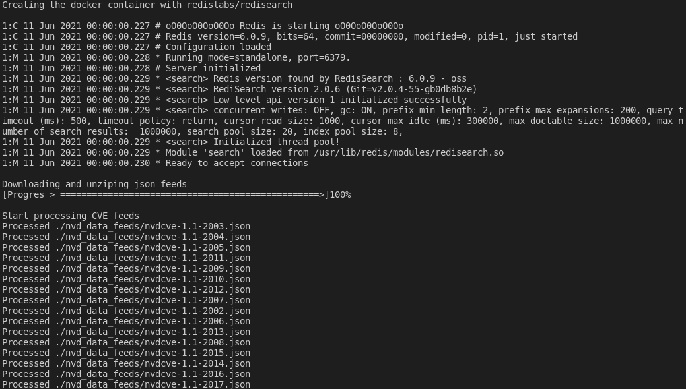
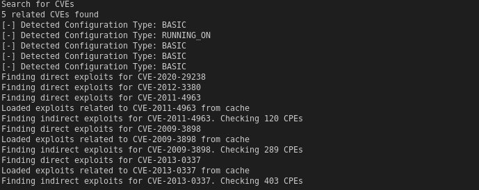
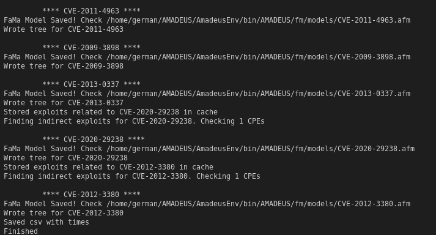
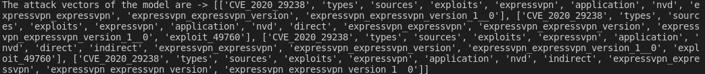
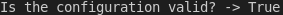
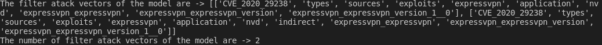
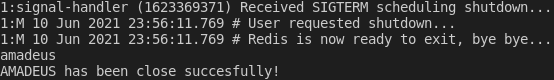

# AMADEUS: AutoMAteD secUrity teSting

AMADEUS is a framework solution to enable and help the automatic analysis and testing of cybersecurity vulnerabilities of configuration systems based on feature models. AMADEUS can automatically analyse the organisation infrastructure determining the vulnerabilities by querying vulnerability repositories.

## Setting up

### Requirements
The minimum software requirements to run AMADEUS are:

* Python  3
* Docker to run a Redis instance with the Redisearch module loaded
* An Internet connection

In addition, if you plan to run automatic network-based vulnerability tests, you may need to install [Nmap](https://nmap.org) in your system and configure your path properly.

### Installation

This step involves the process of retrieving and installing required dependencies (modules) that AMADEUS requires. To proceed, open a new shell interpreter and simply run the following commands:

```cd /path/to/amadeus```
```pip install -r requirements.txt```

## Usage

AMADEUS supports two types of execution. In either of those, you can type the command ```--help``` to display the following explanatory dialog.

```
$ python main.py -h

usage: main.py [-h] [-k KEYWORD] [-e] [-a] [-t TARGET]


optional arguments:

-h, --help  show this help message and exit

--open  Launch the dockerized redislab/redisearch module

--close  Close and delete the dockerized redislab/redisearch module

-k KEYWORD, --keyword KEYWORD

	Keyword used to perform a manual CVE search on vulnerability databases

-e  If the results from NVD must be an EXACT match of the

	Whether the results from databases must be an EXACT match of the keywords or just contain them

-a  Launches NMAP to perform an automatic search of

	vulnerabilities

-t TARGET, --target TARGET

	CIDR block or host target of the automatic analysis

-p PRODUCTS, --products PRODUCTS

    The feature model path to perfom the products operation

-pn PRODUCTSNUMBER, --productsnumber PRODUCTSNUMBER

    The feature model path to perfom the products number operation

-vc VALIDCONFIG VALIDCONFIG, --validconfig VALIDCONFIG VALIDCONFIG

    The feature model path and a configuration to perfom the valid configuration operation. Configuration pattern [a-zA-Z0-9_:^]. Example: a:7:C or 9:^b:^D, the ^ implies it is a none selected feature

-f FILTER FILTER, --filter FILTER FILTER

    The feature model path and a configuration to perfom the filter operation. Configuration pattern [a-zA-Z0-9_:^]. Example: a:7:C or 9:^b:^D, the ^ implies it is a none selected feature
```

###  Automatic launch of dockerized Redis
For launch AMADEUS you only need to tun the following command:

```python main.py --open```

This command automatically launch the dockerized Redis with the Redisearch module loaded.
Then, automatically download the NVD offline dataset from [their website](https://nvd.nist.gov/vuln/data-feeds), and store the JSON files inside a folder named `nvd_data_feeds`, following this structure: 

```
AMADEUS
|--- ...
|--- nvd_data_feeds
	|--- nvdcpematch-1.0.json
	|--- nvdcve-1.1-2002.json
	|--- ...
	|--- nvdcve-1.1-2020.json
	|--- nvdcve-1.1-recent.json
```

Lastly, process this files in Redis.

Also, if you can close AMADEUS you can run the following command:

```python main.py --close```

Begin a process to close down docker and delete the container.

###  Automatic network analysis

By running the program in this mode, AMADEUS will launch a Nmap analysis to the specified IP (or CIDR block) and identify relevant information of the target system. These details will be used to retrieve potentially related CVE flaws and vector attacks on an online vulnerability database (NVD).

In order to perform an automatic analysis to a specific network, you may run the following command:

```python main.py -a -t 192.168.1.1```

Target (```-t/--target```) can also be a CIDR block:

```python main.py -a -t 192.168.1.1/24```

### Keyword-based manual analysis

By running the program in this mode, AMADEUS will use provided keywords to retrieve potentially related CVE flaws and vector attacks on the NVD offline vulnerability database.

To provide your own keywords and perform a search based on them:
```python main.py -k "YOUR_KEYWORD"```

### Tips
* Optionally, you can set the flag ```-e``` in both approaches to ensure that results obtained from NVD do not only contain the keywords, but they appear in the exact same order.

* Models generated by AMADEUS and their respective constraints (if applicable) may be found under the directory _fm/models_ .

## Output & Examples

Feature models inferred by AMADEUS are expressed using the AFM formatting, used in FaMa-Py. A tool packaged in PyPI Python Package Index, compatible with this kind of format can be then used to perform a series of operations over these models.

First, launch AMADEUS with command ```python main.py --open```:



In order to stage a running example, let's suppose we have discover that the server of our organization is running on Nginx version 1.0. To obtain related vulnerable configurations (or attack vectors) we may instruct AMADEUS to derive a model from that information with command ```python main.py -k "nginx 1"```:





This operation will effectively create some models with the vulnerabilities detected under the path _fm/models_. Now, lets try to make some operations in the model with FaMa-Py help, that parse the model in AFM extension and operate it.

### Number of attack vectors

This operation returns the number of attack vectors by passing the path of a model.

With the command ```python main.py -pn fm/models/CVE-2020-29238.afm``` AMADEUS returns:


### Attack vectors

This operation returns the of attack vectors by passing the path of a model.

With the command ```python main.py -p fm/models/CVE-2020-29238.afm``` AMADEUS returns:



### Valid attack vector

This operation return true in a specified attack vector is in the set of attack vectors of a model or false otherwise. Also check if a partial attack vector can define a sub set of attack vectors, in the case we use a complete attack vector the sub set will be the same. A configuration is specified as a set of selected and non selected features of a model following the pattern ```[a-zA-Z0-9_:^]```. For example for the model CVE-2020-29238 a configuration could be CVE_2020_29238:types:exploits:expressvpn:^direct, the ^ implies it is a none selected feature.

This operations requires the path to the model and a configuration of the same.

With the command ```python main.py -vc fm/models/CVE-2020-29238.afm CVE_2020_29238:types:exploits:expressvpn:^direct``` AMADEUS returns:



### Filter

A partial configuration can be used for filter attack vector in a model, this operations only requires the path to a model and a configuration of the same to filter them.

With the command ```python main.py -f fm/models/CVE-2020-29238.afm CVE_2020_29238:types:exploits:expressvpn:^direct``` AMADEUS returns:



In the last place, for close AMADEUS we can use this command ```python main.py --close```:


